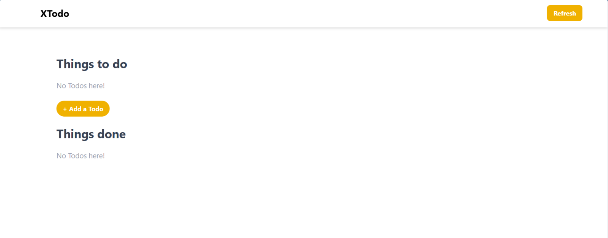

# 📝 XTodo

A clean and minimal Todo application built with **React**, **Vite**, and **Tailwind CSS** to practice React fundamentals such as component-based architecture, state management, props, conditional rendering, and dynamic UI updates.

---

## 📌 Overview

XTodo is a simple task management application where users can:

- Add new tasks
- Mark tasks as completed
- Move completed tasks back to pending
- Clear all tasks using the Refresh button
- Toggle the task creation form
- View pending and completed tasks separately

This project was built to strengthen my understanding of how React components communicate with each other and how state flows through an application.

---

## 🚀 Features

- ✅ Add new todos
- ✅ Mark tasks as completed
- ✅ Move completed tasks back to pending
- ✅ Separate "Things to do" and "Things done" sections
- ✅ Show/Hide Todo creation form
- ✅ Cancel task creation
- ✅ Refresh button to clear all tasks
- ✅ Conditional rendering
- ✅ Responsive UI using Tailwind CSS

---

## 🛠 Tech Stack

- React
- Vite
- JavaScript (ES6+)
- Tailwind CSS

---

## 📂 Project Structure

```
src/
│
├── components/
│   ├── Header.jsx
│   ├── TodoForm.jsx
│   ├── TodoItem.jsx
│   └── TodoList.jsx
│
├── App.jsx
└── main.jsx
```

---

## 🧠 React Concepts Practiced

During this project, I learned and practiced:

- Functional Components
- useState Hook
- Props
- Parent → Child Communication
- Child → Parent Communication using Callback Functions
- Event Handling
- Conditional Rendering
- Rendering Lists using map()
- Updating State Immutably
- Component Reusability

---

## ▶️ Installation

Clone the repository

```bash
git clone <repository-url>
```

Move into the project folder

```bash
cd xtodo
```

Install dependencies

```bash
npm install
```

Start the development server

```bash
npm run dev
```

---

## 📸 Screenshots


- Home Screen

- Add Todo Form

 

---

## 🎯 Future Improvements

- Store todos using Local Storage
- Edit existing tasks
- Delete individual tasks
- Add due dates
- Task categories
- Drag & Drop support
- Dark Mode

---

## 📖 Learning Outcome

Building this project helped me understand how React applications are structured and how data flows between components using props and state. It strengthened my understanding of component reusability, event handling, and conditional rendering while creating a clean and interactive user interface.

---

## 👨‍💻 Author

**Yashasvi Choudhary**

If you have any suggestions or feedback, feel free to connect with me on LinkedIn.